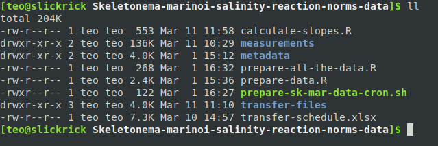

## Use this application with your own data

This app is currently set up to load its data from files stored in a Dropbox folder. We add daily measurements to this folder and have a script working in the background (on a computer with access to that Dropbox folder) compile the new and old measurements into a single dataset. You can see the relevant pieces of code in the preamble to the application code in `app.R` and in the folder `utils/`.

To use your own data, you need to:

1. Set up a directory for your data

2. Change the relevant code in `app.R`, `prepare-data.R` and `calculate-slopes.R` to point to your input files

3. Create a meta data file (this will be used by `prepare-data.R` to compile your daily measurements) 

4. Download the repository from github

### Set up a directory for your data

The data directory should have the following folders. The `measurements` folder is where you would put new (daily) measurements from your experiment. The `metadata` folder is where you would keep the 'experiment' and 'all cases' metadata files and potentially any scripts used to create these files. The `transfer-files` folder is where you would save the transfer sheets for the automated liquid handler (Mari). This is optional, as you might not be using the robot to transfer, and also you can save these wherever you want, perhaps just on a thumbdrive to upload into the robot PC.

```
# data directory folders
measurements
metadata
transfer-files
```

And the following files. 

```
# data directory files
calculate-slopes.R
prepare-all-the-data.R
prepare-data.R
prepare-sk-mar-data-cron.sh
transfer-schedule.xlsx
```

A screen shot of the current setup:



The scripts `prepare-all-the-data.R` and `prepare-sk-mar-data-cron.sh` are optional. The former is a helper that calls the scripts `prepare-data.R` and `calculate-slopes.R` in one go, and the latter is a `bash` script that runs every 10 minutes to update the files in the dropbox folder (basically calls `prepare-all-the-data.R` over and over). If running this app locally (not on the web) you are unlikely to need either of these scripts. So you can remove them or forget about them.

The file `transfer-schedule.xlsx` is also optional, we use it to keep track of when a plate was transferred and when it should be transferred next, as well as to add some notes. But if you have an alternative tracking system you don't need this file. Even if you use the same system, you can keep this file elsewhere -- the app does not use it.

### Change the relevant code to point to your input files

#### Preparing your data

The `prepare-data.R` script processess _all the measurements_, combines them with the _all case_ metadata file, and outputs a `csv` and `Rsave` files that can be read by the app. For this script to work with your data, you need to edit it to adjust the paths to your input files. To point the script to your metadata file, change the line starting with `all_plates_meta` to an `Rsave` file that represents your metadata information (you could change this to `read_csv("full/path/to/csv")` if your data is a spreadsheet and not saved as a binary `R` file).

The second thing you might need to adjust is the path to the folder where the raw measurement csv files are kept. If you are using the same setup as above, then you don't need to change this. But if, for example, you keep your raw data in a foler `raw_data`, then change the line `path_to_experiment <- "measurements"` to `path_to_experiment <- "raw_data"` (or `path_to_experiment <- "/full/path/to/raw_data"` if the raw data are not in the same folder as `prepare-data.R`.

```
# load experiment meta data
all_plates_meta <- get(load("metadata/all_plates_meta.Rsave"))

# if your data is not in a binary R file, comment the line above and uncomment + edit the path below:
# all_plates_meta <- read_csv("metadata/all_plates_meta.csv"))

# where are the data stored
path_to_experiment <- "measurements"
```

#### Calculating slopes

This script takes the output from `prepare-data.R`, groups the data set by zone (sample), strain, treatment, replicate, and transfer, and calculates slopes of relative fluorescence by time (=growth rates). It is short, so we can paste it here and explain what to do if changes are needed:

```
library(tidyverse)
library(broom)

# source("prepare-data.R")
dd <- get(load("measurements/all_data.Rsave"))

slopes <- dd %>% 
  group_by(zone, strain, salinity, replicate, transfer) %>% 
  mutate(day_per_transfer=row_number()) %>% 
  filter(day_per_transfer %in% 2:6) %>% 
  nest() %>% 
  mutate(
    fit = map(data, ~ lm(log(Sum) ~ day_per_transfer, data = .)), results = map(fit, tidy)) %>% 
  unnest(results) %>% 
  filter(term=="day_per_transfer")
  
save(slopes, file="measurements/slopes.Rsave")
write_csv(slopes, path="measurements/slopes.csv")
```

As before, we want to point the script to the file with all data, dependent on where you saved it with `prepare-data.R`. If the default setup is maintained, no changes should be needed. 

Also, the script is subseting the dataset to only those rows that correspond to measurements taken on days 2-6 within each transfer (the `filter(day_per_transfer %in% 2:6)` line). However if you want to include day 1, or if you don't measure for at least 6 days for each transfer, adjust this range.

#### Tell the app where to find your files

Below are the first few lines of `app.R` that get run every time the app starts (before any other code). The default setup is to read from a dropbox folder, but now that you have set up a different directory and have different meta, measurements, and slopes files you want to change `app.R` to load your files. The excerpt below has comments that explain what to do.

```
# change the paths below to match where your data is stored. for loading from dropbox, the paths should be relative to the dropbox root
slopes <- drop_read_csv("Skeletonema-marinoi-salinity-reaction-norms-data/measurements/slopes.csv", stringsAsFactors=FALSE)
dd <- drop_read_csv("Skeletonema-marinoi-salinity-reaction-norms-data/measurements/all_data.csv", stringsAsFactors=FALSE)

# if running locally (without dropbox), comment the two lines above and uncomment the four lines below. best to use absolute paths
# source("full/path/to/prepare-data.R")
# source("full/path/to/calculate-slopes.R")
# slopes <- read_csv("full/path/to/slopes.csv")
# dd <- read_csv("full/path/to/all_data.csv")

# set the levels according to your treatments and desired order
# currently assumes the treatment variable is called `salinity``, 
# if the treatment column is called something else, modify these two lines appropriately
# in this case additional changes will be needed in app.R
slopes <- mutate(slopes, salinity=factor(salinity, levels=paste(c(8,12,16,20,24,28), "ppt")))
dd <- mutate(dd, salinity=factor(paste(treatment, "ppt"), levels=paste(c(8,12,16,20,24,28), "ppt")))

# to make sure these variables are in the appropriate format
dd <- mutate(dd, rep=factor(replicate))
dd <- mutate(dd, dayn=as.numeric(day))
```

### Create a meta data file

The metadata file should be a spreadsheet in csv format with the following columns. Note that `experiment` and `plate_number` are optional. Everything else is required. The `zone` column is unfortunately named, as this might represent a sample or species, but you'll live with it (for now).

```
plate_name,zone,strain,treatment,row,column,well
a1,A,A.2.21b,8,A,1,A1
a1,A,A.2.21b,12,B,1,B1
a1,A,A.2.21b,16,C,1,C1
a1,A,A.2.21b,20,D,1,D1
a1,A,A.2.21b,24,E,1,E1
a1,A,A.2.21b,28,F,1,F1
a1,A,A.2.27b,8,A,2,A2
a1,A,A.2.27b,12,B,2,B2
```

