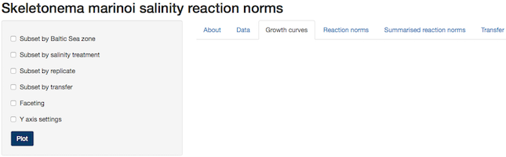
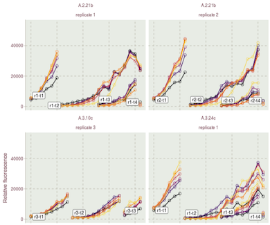
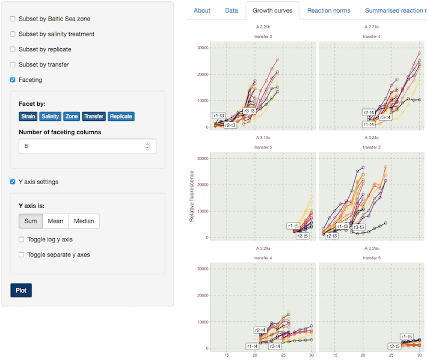
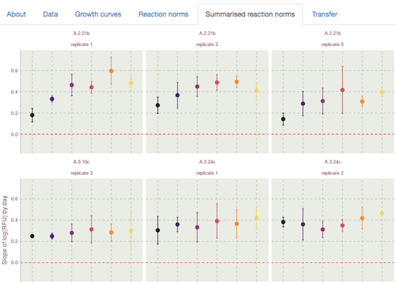

### How to use this web application

#### Types of data

There are two types of data stored here: daily measurements of relative fluorescence per well of the plate and linear regression slopes of relative fluorescence by day. The daily measurements are themselves summary statistics (Sum [default], Mean, Median, SD) of measurements done across a grid on the bottom of a well. The slopes are calculated for each replicate and transfer separately. These data can be plotted by chosing the appropriate tab in the menu: `Growth curves` and `Reaction norms`. The `Summarised reaction norms` tab shows means and standard deviations of the individual estimates of the growth rates (slope of relative fluorescence through time). 

#### Presets

Presets show data for zone A with all replicates and current transfers at all salinity treatments in 8 columns of graphs. The graphs produced are delineated by strain and replicate number, so individual graphs depict RF data for all transfers of one replicate of the strain indicated above the graph. Labels of `r#-t#` mark the starting point (day of experiment) of a particular replicate and transfer, as not all cases begin the same time. The Y-axis is set to use the sum of the relative fluorescence reads from a grid for each well, but that can be changed to show the mean or median value. The sum is set as default because it is more closely comparable to relative fluorescence measurements made with a cuvete-based fluorometer also used in our lab. 

#### Subsets and faceting

Subset options are used to limit or expand the data displayed based on treaments, replicates, and transfers. Faceting determines how the selected data are separated for plotting. Changing the presets to facet by strain and transfer results in the format shown below, with each graph displaying the growth of all replicates over the time that a particular plate was measured before the cultures were transfered to a new plate. Altering the number of columns adjusts the dimensions of the graphs and can improve data visibility. Y-axis settings of course allow you to define the scale of the y-axis, but here you can also select the type of data used to calculate the growth curve displayed: Sum of the relative fluorensce (RF) measurements, Mean of RF, or Median of RF. 

 

#### Reaction norms tabs

Graphs viewed under the reaction norm tabs are based on the slopes of growth curves at each salinity treatment. Using the various options provided in the menu, these graphs can be subset and faceted in the same way growth curves are. Summarised reaction norms give the best overview of salinity tolerance of each strain and zone. Here you can find the average of the slopes displayed for selected data, with error bars indicating the standard deviation for each treatment. 

